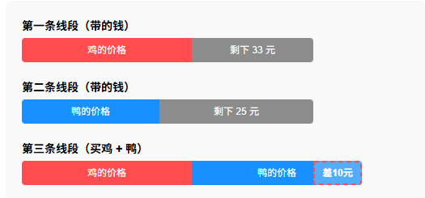

## 题目

> 妈妈去菜场买菜，买一只鸡的话剩33元，买一只鸭的话剩25元，如果两个都买的话还差10元，问妈妈带了多少钱？

## 分析

- 从成年人视角看的话很标准的三个方程，三个未知数，很好理解，甚至不需要思考，方程法就是顺过程的。
- 但是小低年级没有学过方程，甚至就算学过了，也不会三个方程联立求解，所以就需要画线段图来辅助理解。

## 解答

见示意图，对比第一条线段和第三条线段，可以得出鸭的价格-10=33，所以鸭子43元。故由第二条线段，一共带了68元。

## 小结

- 小学数学现在淡化了方程，强化了思维的理解，对教和学都提出了更高的要求。